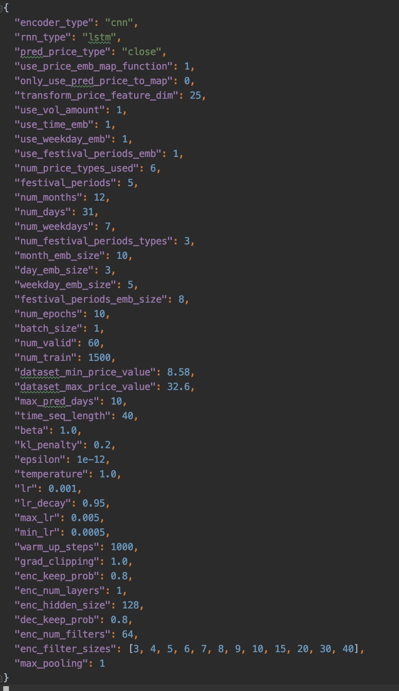

# 股价预测模型

## 目的
根据历史股票价格信息预测将来几天的股价

## 方法
用时间序列编码器对历史几天的股票价格以及日期相关的一些特征进行编码，解码器用时间序列模型对将来几天的股价进行预测

## 模型
- 编码器： LSTM/BiLSTM, CNN
- 解码器： LSTM

## 框架/工具
- Tensorflow >= 1.11
- Python3.X
- Pandas
- Matplotlib

## 一些超参数配置说明
### 具体配置可参见```configs/config.json```文件

- encoder_type: 编码器模型结构类型
    - values(str): rnn, birnn, cnn
- rnn_type: rnn的结构，目前只支持LSTM
    - value(str): lstm
- pred_price_type: 需要预测的价格信息, 比如收盘价，最高价，最低价和开盘价
    - values(str): close, high, low, open
- use_price_emb_map_function: 是否需要用价格映射函数，在解码的时候可能会用到
    - value(int): 1, 0
- only_use_pred_price_to_map: 是否只映射需要被预测的价格
    - value(int): 1, 0
- use_vol_amount: 是否需要用到成交量和成交额信息作为特征输入
    - value(int): 1, 0
- use_time_emb: 是否要用日期时间embedding
    - value(int): 1, 0
- use_weekday_emb: 是否要用星期几的时间embedding
    - value(int): 1, 0
- use_festival_periods_emb: 是否需要判断某个日期是在节日前几天，节日后几天，还是节日期间
    - value(int): 1, 0
- num_price_types_used: 总共用到了几种价格信息特征，如果**use_vol_amount=0**就是4种，否则6种
    - value(int): 6, 4
- festival_periods: 判断日期时间是否在节日期间的阈值范围内
    - value(int): *
- num_months: 12个月
    - value(int): 12
- num_days: 一个月最多31天
    - value(int): 31
- num_weekdays: 一礼拜7天
    - value(int): 7
- num_festival_periods_types: 节日前几天，节日后几天，节日期间，3种类型
    - value(int): 3
- month_emb_size: month embedding大小
    - value(int): *
- day_emb_size: day embedding大小
    - value(int): *
- weekday_emb_size: weekday embedding大小
    - value(int): *
- festival_periods_emb_size: 日期类型embedding大小
    - value(int): *
- num_epochs: 训练几个epochs
    - value(int): *
- batch_size: batch size
    - value(int): *
- num_valid: 多少数据作为验证集
    - value(int): *
- num_train: 多少数据作为训练集
    - value(int): *
- dataset_min_price_value: 被预测价格在训练集里的最小值
    - value(float): *
- dataset_max_price_value: 被预测价格在训练集里的最大值
    - value(float): *
- max_pred_days: 模型预测将来最多几天的数据
    - value(int): *
- time_seq_length: 模型输入历史几天的数据
    - value(int): *
- beta: **price_emb_map_squared_mean_loss**的正则化系数
    - value(float): *
- kl_penalty: **kl_loss**的正则化系数
    - value(float): *
- epsilon: epsilon
    - value(float): *
- temperature: temperature
    - value(float): *
- lr: learning rate
    - value(float): *
- lr_decay: learning rate decay rate
    - value(float): *
- max_lr: max learning rate
    - value(float): *
- min_lr: min learning rate
    - value(float): * 
- warm_up_steps: warm up steps
    - value(int): * 
- grad_clipping: gradients clipping
    - value(float): * 
- enc_keep_prob: encoder keep prob
    - value(float): * 
- enc_num_layers: encoder num layers
    - value(int): * 
- enc_hidden_size: encoder hidden size
    - value(int): * 
- dec_keep_prob: decoder keep prob
    - value(float): * 
- enc_num_filters: **cnn**的filters个数
    - value(int): * 
- enc_filter_sizes: **cnn**不同filter的size大小
    - value(list): * 
- max_pooling: 是否要用max pooling
    - value(int): 1, 0


## 一些主要文件夹目录以及文件说明：

      data：实验数据, 里面有黄山旅游股票的最近几年股价数据
      ckpts: 存放训练好的模型checkpoints文件目录
      configs/config.json: 一些超参数配置文件
      run_train.sh: 启动训练bash文件
      run_valid.sh: 启动验证bash文件
      run_pred.sh: 启动预测bash文件
      train.py: 训练过程python文件
      predict.py: 进行实际预测python文件
      model_utils/model_construction.py: 模型结构代码文件
 

## 代码运行说明
- 训练过程：在**configs/config.json**设置好超参数，以及在**run_train.sh**文件设置好一些基本参数后，运行```bash run_train.sh```
- 验证过程：在**run_valid.sh**文件设置好一些基本参数后，运行```bash run_valid.sh```
    - ```验证过程结束后，在/ckpts/huangshan/plots/文件夹里查看在验证集上预测的结果, predictions.txt文件会记录具体的预测值，映射值以及ground truth value```
- 预测过程：在**run_pred.sh**文件设置好一些基本参数后，运行```bash run_pred.sh```
